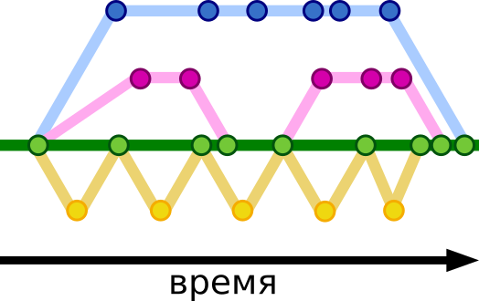

# Ветвление

Во время разработки часто приходится менять и добавлять отдельные части проекта не затрагивая остальную часть этого проекта, а также разработку могут вести несколько людей.

***Ветвление*** - процесс создания отличных друг от друга версий репозиториев. 

На схеме:
+ _Круги_ - точки фиксаций изменений в репозитории (коммиты).
+ _Зеленая ветка_ - ветка проекта для конечного пользователя.

Все разработчики начинают процесс разработки с одной и той же версии проекта, но затем каждый вносит свои изменения, что и приводит к возникновению разных версий.

В том случае, когда один разработчик находит ошибки в работе другого, ветвление с фиксацией изменений позволяет исправлять эти ошибки без _отката_ всего проекта на предыдущие версии.

---

## Создание ветки и переключение на ветку

***git branch*** — команда, которая создает новую ветку в репозитории.  
`git branch [наименование]`

***git checkout*** — команда, которая переключает вас на определенную ветку.  
`git checkout [наименование]`

***git checkout -b*** — создаёт новую ветку и переключает вас на неё.  
`git checkout -b [наименование]`

---

## Объединение ветвей

***git merge*** — поглощение. Вносит коммиты из другой ветки в текущую.  
`git merge [наименование]`

***git rebase*** — перебазирование. В этом случае коммиты вашей ветки накладываются поверх текущего состояния указанной ветки.  
`git rebase[наименование]`